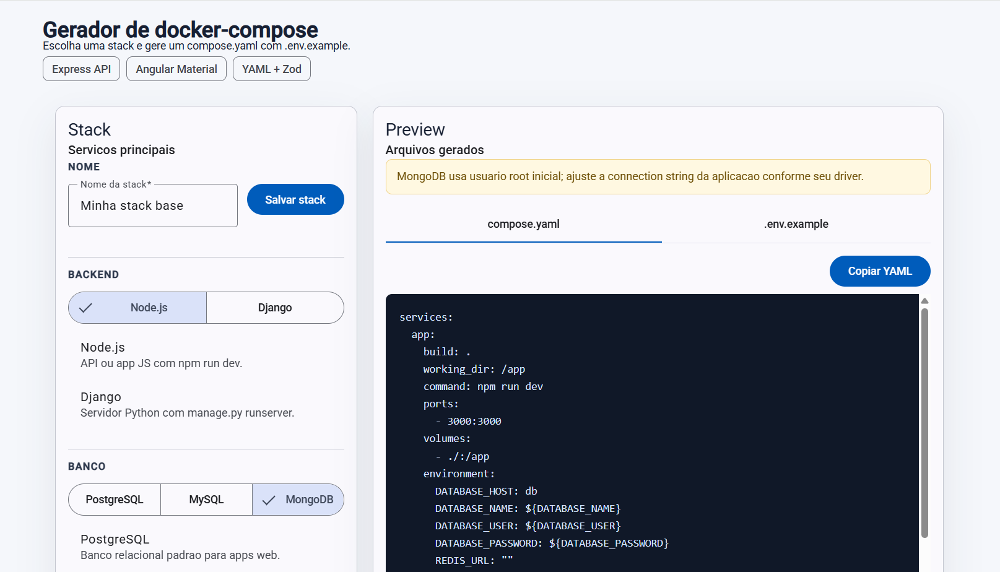

# Compose Generator Simple 

A simple `docker-compose` generator with:



- `app-client/compose-gen`: Angular
- `app-server`: Express + Zod + YAML + Prisma
- PostgreSQL for storing stack presets

## Run the backend with Docker

```bash
docker compose up -d --build
````

## app-server Endpoints

* `GET /health`
* `POST /generate`
* `GET /stacks`
* `POST /stacks`

## Example of a saved stack

```json
{
  "name": "Node Postgres Base",
  "backend": "node",
  "database": "postgres",
  "cache": "redis",
  "adminTools": ["pgadmin"]
}
```
